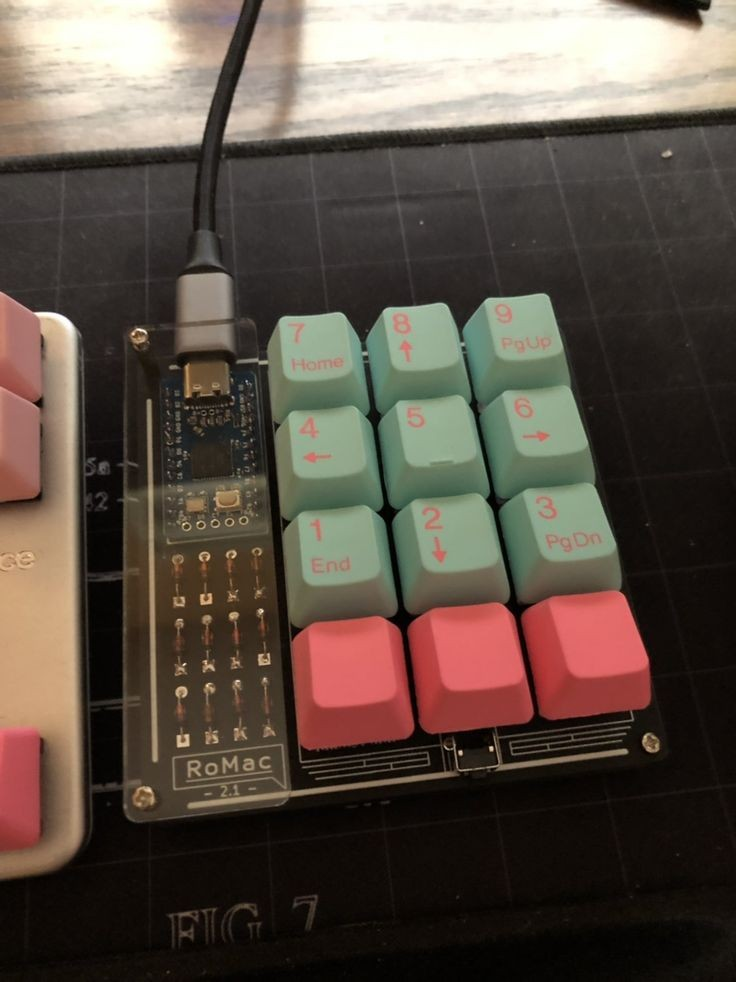
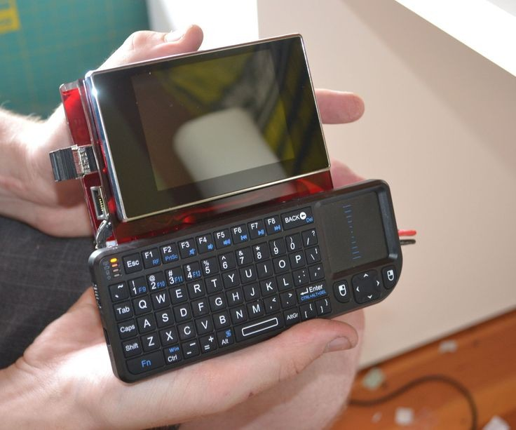
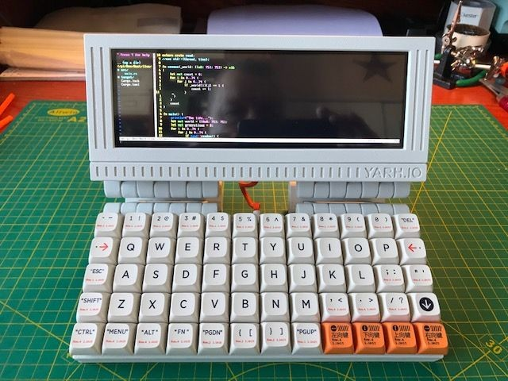
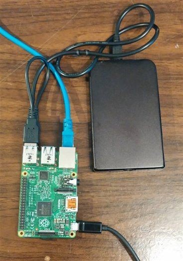

# a deep dive into hardware projects 
 
i've been hoping for the <b>rpi zero</b> to go on sale at the arcade shop for a while and finally have the tickets to place an order, so i started brainstorming to think about what i'd want to do with it. i've heard great reviews, spectacular even, but with no hands-on experience on a personal level, i turned to my good old friend, the google search engine. 
  

# starting off
so,, firstly, i started off with a few things in mind :  
- what i have  
- what i could get my hands on  
- what i wanted to make  
- what i wanted to learn from the building experience   

# working with what i have :  
- i NEED to get a raspberry pi desperately  
- parts that come with bin  
- custom pcb with leftover money from onboard grant  
- old android phones that either don't / barely work & can be dissected for parts without alarming my parents  
- old tablets (android) that can be repurposed as external monitors for my setup (consisting of my laptop, that's it)

  

# my objective for the near-ish future <a href ="https://www.pocket-lint.com/how-to-use-raspberry-pi-5-beginner-projects/">was</a> :  
- to build macropad with 2+ knobs / general numpad (using pi pico + customized pcb)   
   
- to build cyberdeck / <a href="https://www.instructables.com/Make-a-Portable-Computer-Using-a-Raspberry-Pi/">portable desktop computer using raspberry pi 5 </a> (either a palm-top or a briefcase enclosed pc)   
 
 
    - raspberry pi 5's system-on-chip has been upgraded + i/o speeds have been improved  
    - debian based linux operating systems do work but windows on R doesn't  
    - external pcle 2.0 port so you can run your OS from a fast external nvme ssd  
- to host my own cloud server / media server using raspberry pi  
- to host home network storage / NAS <a href = "https://www.youtube.com/watch?v=gyMpI8csWis">(network addressed storage) using raspberry pi 5 </a>  
{width=30}
 
- to salvage parts i had lying around from old used-up and unusable tech   

# what i quickly found out :
- i do NOT have the skillset for this. not at all. not even one part of it. this is all very advanced stuff and requires years of experience and a LOT of hours of understanding. i need to aim smaller, change the goal, be realistic.  
- i should learn more about the gemini pda, cosmo communicator, astro slide etc.  
- i should stick to software modifications for now because firmware >>> hardware (sorry)  
